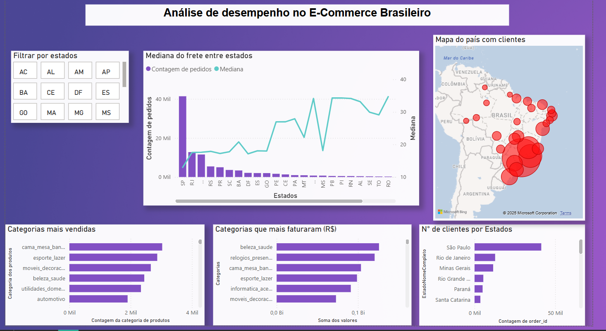

# Analise-do-E-Commerce-Brasileiro
Este projeto tem como objetivo explorar e analisar dados de um e-commerce brasileiro (Olist) utilizando Python e Power BI, os datasets foram extraídos da plataforma Kaggle, para encontra-los [Acesse o Kaggle da Olist](https://www.kaggle.com/datasets/olistbr/brazilian-ecommerce). A análise abrange desde o comportamento de clientes até o desempenho de produtos e categorias, oferecendo insights valiosos para tomadas de decisão estratégicas.

## 🧰 Tecnologias Utilizadas
- Python (pandas, matplotlib)
- Power BI (dashboards interativos)
- Jupyter Notebook

##  📁 Fontes de Dados
Os dados utilizados são oriundos do repositório público da Olist no Kaggle e incluem:

- olist_orders_dataset.csv
- olist_order_items_dataset.csv
- olist_products_dataset.csv
- olist_customers_dataset.csv

📂 Estrutura do projeto:
- ├── Notebook/
 - │   └── analiseDados.ipynb
- ├── Datasets/
 - │   └── *.csv
- ├── Imagens/
 - │   └── dashboard.png
- ├── Dashboard/
 - │   └── Analise_eCommerce.pbix
- └── README.md

## 📌 Principais Análises Realizadas
## 🔍 Em Python:
- Produtos mais vendidos e suas categorias
- Faturamento por categoria de produto
- Valor médio do frete por estado
- Estados com maior número de clientes
- Cliente mais recorrente da base

## 📈 Em Power BI:
- Dashboard geral com KPIs (clientes, pedidos, receita)
- Análises por região e por categoria de produto
- Mapa de calor de distribuição de clientes
- Gráficos interativos para filtros por tempo e localização

## 🖼️ Imagem do dashboard

## 📎 Resultados Interessantes
- 📦 A categoria com maior faturamento foi Beleza & Saúde
- 🚚 O estado com maior valor médio de frete foi AC (R$ 35,74)
- 👥 O cliente mais recorrente realizou 17 pedidos

🚀 Como Executar: 
clone o repositório: 

`git clone https://github.com/GuilhermeDamazio/Analise-do-E-Commerce-Brasileiro.git`

